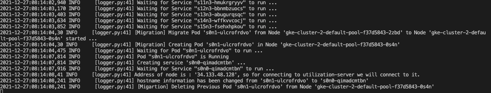
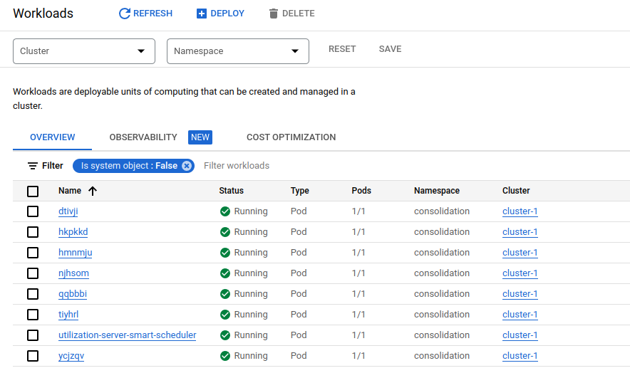

# 1. Introduction
## 1.1. Repo contetns
This repo contains the code of the upcoming vpa aware scheduling paper

## Setup the environment in your machine
1. Download source code from GitHub
   ```
    git clone https://github.com/saeid93/smart-scheduler
   ```
2. Download and install [miniconda](https://docs.conda.io/en/latest/miniconda.html)
3. Create [conda](https://docs.conda.io/en/latest/miniconda.html) virtual-environment
   ```
    conda create --name smartscheduler python=3
   ```
4. Activate conda environment
   ```
    conda activate smartscheduler
   ```
5. if you want to use GPUs make sure that you have the correct version of CUDA and cuDNN installed from [here](https://docs.nvidia.com/deeplearning/cudnn/install-guide/index.html)
6. Use [PyTorch](https://pytorch.org/) or [Tensorflow](https://www.tensorflow.org/install/pip#virtual-environment-install) isntallation manual to install one of them based-on your preference

7. Install the followings
   ```
    sudo apt install cmake libz-dev
   ```
8. Install requirements
   ```
    pip install -r requirements.txt
   ```
9. setup [tensorboard monitoring](docs/monitorings/tensorboard.md)

# 2. Kubernetes Cluster Setup
If you want to do the real world Kubernetes experiemnts of the paper you should also do the following steps.
There are several options for setting up a Kuberentes cluster. The repo codes can connect to the cluster through the [Python client API](https://github.com/kubernetes-client/python) as long as you have access to the kube config address e.g. `~/.kube/config` in your config files specified.

We have used [Google Cloud Platform](https://cloud.google.com/) for our experiments.
You can find the toturial for creating the cluster on google cloud and locally in the followings:

* [Google cloud installation](docs/kubernetes/installation-gcp.md)
* [Local cluster setup installation](docs/kubernetes/installation-local.md)

# 3. Project Structure

1. [data](data)
2. [docs](docs)
3. [experiments](experiments)
4. [smart-scheduler](smart_scheduler)

The code is separated into three modules
   1. [data](data): This is the folder containing all the configs and results of the project. Could be anywhere in the project.
   3. [smart-scheduler](smart-scheduler): the core simulation library with [Open-AI gym](https://gym.openai.com/) interface
   4. [experiments](experiments): experiments of the paper and the reinforcement learning side of codes.

## 3.1. [smart-scheduler](smart-scheduler)
### Structure
* [src](smart-scheduelr/src): The folder containing the smart-scheduler simulators. This should be installed for using.

### Usage
Go to the [smart-scheduler](smart-scheduler/smart_scheduler) and install the library in the editable mode with
   ```
   pip install -e .
   ```

## 3.2. [data](data)
### Structure
Link the data folder (could be placed anywhere in your harddisk) to the project. A sample of the data folder is available at [data](data).

### Usage
Go to [experiments/utils/constants.py](experiments/utils/constants.py) and set the path to your data and project folders in the file. For example:
   ```
   DATA_PATH = "/Users/saeid/Codes/smart-scheduler/data"
   ```

## 3.4. [experiments](experiments)

### 3.4.1. [Dataset Preprocessing]()
### 3.4.1.1 [Arabesque]()

### 3.4.1. [Data Generation](experiments/cluster)
The cluster and workloads are generated in the following order:
1. **Clusters**: Nodes, services, their capacities, requested resources and their initial placements. 
2. **Workloads**: The workload for each cluster that determines the resource usage at each time step. This is built on top of the clusters built on step 1. Each cluster can have several workloads.

To generate the clusters, workloads, networks and traces, first go to your data folder (remember data could be anywhere in your disk just point the data folder as  [experiments/utils/constants.py](experiments/utils/constants.py)).

#### 3.4.1.1. [Generating the clusters](experiments/cluster/generate_cluster.py)

Go to the your cluster generation config [data/configs/cluster-generation/](data/configs/cluster-generation) make a folder named after your config and make the `config.json` in the folder e.g. see the `my-cluster` in the sample [data](data) folder [data/configs/generation-configs/cluster-generation/my-cluster/config.json](data/configs/generation-configs/cluster-generation/my-cluster/config.json). Then run the [experiments/cluster/generate_cluster.py](experiments/cluster/generate_cluster.py) with the following script:
```
python generate_cluster.py [OPTIONS]

Options:
  --cluster-config-folder TEXT      config-folder
  [default:                         my-cluster] 
```
For a full list of `config.json` parameters options see [cluster-configs-options](docs/configs-parameters/cluster-generation.md). The results will be saved in [data/clusters/<cluster_id>](data/clusters).

#### 4.4.1.2. Generating the Workloads

#### 4.4.1.2.1. [Generating the Workloads - Option one - Random](experiments/cluster/generate_workload.py)

Go to the your workload generation config [data/configs/generation-configs/workload-generation](data/configs/generation-configs/cluster-generation) make a folder named after your config and make the `config.json` in the folder e.g. see the `my-workload` in the sample [data](data) folder [data/configs/generation-configs/workload-generation/my-workload/config.json](data/configs/generation-configs/cluster-generation/my-workload/config.json). For a full list of `config.json` see. Then run the [experiments/cluster/generate_cluster.py](experiments/cluster/generate_cluster.py) with the following script:
```
python generate_workload.py [OPTIONS]

Options:
  --workload-config-folder TEXT      config-folder
  [default:                          my-workload] 
```
For a full list of `config.json` parameters options see [workload-configs-options](docs/configs-parameters/workload-generation.md). The results will be saved in [data/clusters/<cluster_id>/<workload_id>](data/clusters).
<br />
#### 4.4.1.2.2. [Generating the Workloads - Option two - Real-world](experiments/cluster/generate_workload.py)
Change it to Alibaba and Arabesque
Go to the your workload generation config [data/configs/generation-configs/workload-generation](data/configs/generation-configs/cluster-generation) make a folder named after your config and make the `config.json` in the folder e.g. see the `my-workload` in the sample [data](data) folder [data/configs/generation-configs/workload-generation/my-workload/config.json](data/configs/generation-configs/cluster-generation/my-workload/config.json). For a full list of `config.json` see. Then run the [experiments/cluster/generate_cluster.py](experiments/cluster/generate_cluster.py) with the following script:
```
python generate_workload.py [OPTIONS]

Options:
  --workload-config-folder TEXT      config-folder
  [default:                          my-workload] 
```
For a full list of `config.json` parameters options see [workload-configs-options](docs/configs-parameters/workload-generation.md). The results will be saved in [data/clusters/<cluster_id>/<workload_id>](data/clusters).
<br />


### 4.4.2. [Training](experiments/training) and [analysis](experiments/analysis)

#### 4.4.2.1. [Training the agent](experiments/training/learner.py)

1. change the training parameters in `<configs-path>/real/<experiment-folder>/config_run.json`. For more information about the hyperparamters in this json file see [hyperparameter guide](docs/learning/hyperparameter-guide.md)
2. To train the environments go to the parent folder and run the following command.
```
python experiments/learning/learners.py --mode real --local-mode false --config-folder PPO --type-env 0 --cluster-id 0 --workload-id 0 --use-callback true
```

### 4.4.2. [Analysis](experiments/analysis)

#### 4.4.2.1 [check_env](experiments/check_env.py)

#### 4.4.2.2 [check_learned](experiments/check_learned.py)

#### 4.4.2.3 [test_baselines](experiments/test_baselines.py)

#### 4.4.2.4 [check environment](experiments/test_rls.py)

#### 4.4.2.5 [check environment](experiments/analysis_test.ipynb)

#### 4.4.2.6 [check environment](experiments/analysis_train.ipynb)


### 4.4.4. [Kubernetes interface](mobile-kube/src/smart_scheduler/util/kubernetes_utils)

The Kubernetes interface is designed based-on the Kubernetes [api version 1](https://kubernetes.io/docs/reference/generated/kubernetes-api/v1.21/).

The main operations that are currently implemented are:
* creating
  * cluster
  * utilisation server
  * pods
* actions
  * scheduling pods to nodes
  * moving pods (not used in this work)
  * deleting pods
  * cleaning nemespace
* monitoring
  * get nodes resource usage
  * get pods resource usage

a sample of using the interface can be found [here](experiments/kube_operations.py)

# 4. Sample run on GKE cluster

Log of a running emulation - moving service 0 from node 1 to node 0 (s0n1 -> s0n1)



Google cloud console of a running emulation - moving service 0 from node 1 to node 0 (s0n1 -> s0n1)



# 5. Other

1. [Step by step guide to trainig the code on EECS](docs/step-by-step-guides/EECS.md)

2. [Step by step guide to trainig the code on GKE](docs/step-by-step-guides/GKE.md)

3. [List of running ray problems](docs/problems/ray.md)

4. [List of QMUL EECS problems](docs/problems/eecs-server-setup.md)

5. [Tensorboard Monitoring](docs/monitorings/tensorboard.md)

6. [Cluster Monitoring](docs/monitorings/cluster.md)
